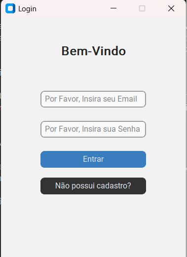
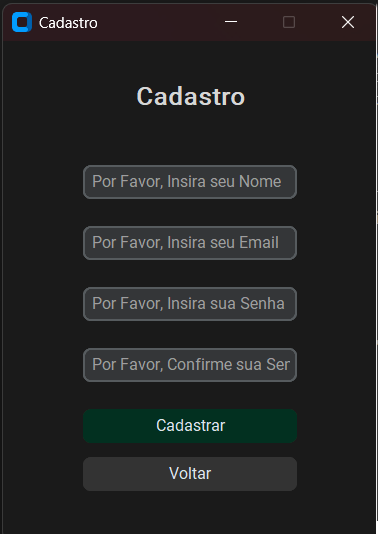
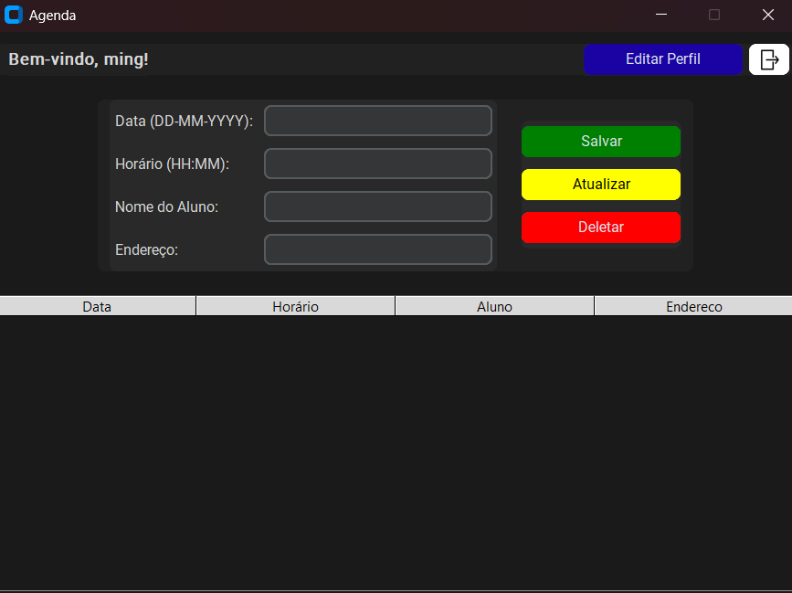

## PROJETO RAD PYTHON

## COMO INSTALAR
- Instale a versão mais recente do Python:  
  [https://www.python.org/downloads/](https://www.python.org/downloads/)

- Utilize a funcionalidade do `pip` para instalar estas duas bibliotecas:

```bash
pip install customtkinter
pip install pillow
```
## Descrição do projeto 
Desenvolvemos uma aplicação para o controle de aulas particulares 
agendadas, na qual o professor cadastrado no sistema possui a visão das
aulas pendentes em um determinado período.

## Funcionalidades

Possuímos uma tela de login, cadastro e edição de usuário, vinculada a um 
banco de dados SQLite, que utiliza criptografia MD5 por meio da biblioteca 
hashlib, armazenando apenas a senha criptografada no banco de dados.




Possuímos, em nossa tela principal, uma tabela na qual o banco de dados retorna as
aulas que o professor possui marcadas, exibindo o nome, o dia, o horário e, inclusive,
o endereço do aluno.

Logo acima, pode-se visualizar também um pequeno formulário para o cadastro de 
novos alunos.
A tela recebe o professor com uma mensagem de boas-vindas e, à direita, apresenta a 
opção de editar algum dado da conta do professor.

